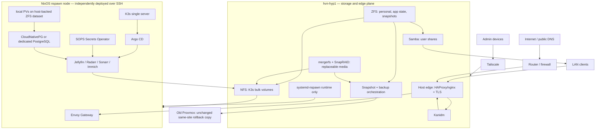
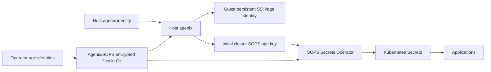

# Target architecture

## System context

## Responsibility boundary

### `hvn-hyp1` owns

- physical disks, HBA/enclosures, SMART, encryption and unlock;
- ZFS pool/vdev/dataset lifecycle;
- mergerfs branches, SnapRAID parity/content/sync/scrub lifecycle;
- local snapshots, application backup staging, and static Proxmox rollback-copy bookkeeping;
- NFS exports to the fixed guest address and SMB exports to users;
- LAN bridge, firewall, public TLS edge, Kanidm, and Tailscale;
- nspawn machine definition, persistent mount/device attachment, start/stop, and initial identity injection;
- break-glass access to the stopped guest filesystem and console.

### The K3s guest owns

- its NixOS closure, service configuration, and routine rollback over SSH;
- K3s/containerd state;
- Kubernetes objects and GitOps bootstrap;
- application deployment, probes, resource policy, and migration jobs;
- logical/application-consistent database and configuration exports;
- application identity integration and secrets after cluster bootstrap.

### Git owns

- host and guest desired NixOS configurations, without plaintext secrets;
- Nixidy application definitions and encrypted generated secrets;
- runbook commands, expected object inventory, schema, and recovery declarations;
- pinned versions and reviewed migrations.

Git does not own user data, database dumps, media catalogs containing sensitive filenames unless separately encrypted, or live credentials.

## Physical storage and data tiers

The final vdev/disk count must follow inventory. The logical design is fixed now.

Phase 0 constrains the physical implementation:

- Critical storage uses ZFS mirror vdevs only: two-way RAID1 semantics, expanded by adding another mirrored pair. Application state and personal originals use separate physical pools. Do not use RAIDZ or dRAID in the target design.
- Four 1 TB Intel NVMe devices are available; two are installed but currently expose approximately 100 GB namespaces. Enlarge or rebuild the root namespace safely, then allocate a separate two-device NVMe mirror for guest/application state. This is reuse of owned hardware, not a new-drive purchase.
- The R730xd has 12 storage slots, with a hard operational ceiling of 11 occupied. Reserve one bay at all times so a replacement disk can be attached and resilvered/recovered before removing the old member where hardware condition permits.
- After old Proxmox is evacuated and verified, reuse suitable 8 TB disks as one or two HDD mirror pairs for Immich originals, household files, and other irreplaceable personal data. Seven 12 TB bulk disks plus at most four 8 TB mirror members reaches the 11-slot ceiling.
- Replace temporary gocryptfs with kernel-space encryption. Use per-disk LUKS2 below each independent bulk filesystem so SnapRAID operates on the mounted cleartext view; use ZFS native encryption for critical mirrors unless the recovery proof selects LUKS2-under-ZFS.
- Current path names, filesystem choices, and branch numbering are not contracts. Define stable disk IDs, labels, mount paths, and application paths from scratch.
- Keep old Proxmox online and read-mostly until media, fileserver data, application exports, and all other authoritative roots have verified destinations. At 98% pool allocation and with no backup plan, it is a migration source under immediate risk.

| Tier | Intended data | Storage | Kubernetes exposure | Protection |
|---|---|---|---|---|
| S0 disposable | downloads, transcodes, ML/model cache, thumbnails reproducible from originals, container images | dedicated SSD/NVMe cache dataset | local PV or NFS scratch as required | no backup; quotas and cleanup |
| S1 guest/system state | SSH identity, K3s server state, local kubeconfig, GitOps bootstrap state | dedicated dataset on a redundant services pool attached at stable guest `/persist` paths | not a general PVC | local snapshots, application exports, rebuild test; legacy cutover exports remain on Proxmox |
| S2 application state | PostgreSQL, app config, Immich metadata/profile, GitOps state exports | redundant services-pool dataset | default local StorageClass | app-aware local backups plus snapshots; no current remote RPO |
| S3 personal originals | Immich-uploaded originals, user-private/shared files, document-sync data | redundant personal-data ZFS datasets | static NFS PVs, one owner per subtree | frequent local snapshots; unchanged Proxmox copy only for data present at cutover |
| S4 replaceable media | ordinary movies, TV, music | mergerfs data disks + SnapRAID parity | static read/write NFS PV for managers, read-only where possible | SnapRAID sync/scrub plus unchanged pre-migration Proxmox corpus |
| S5 curated media | explicit hard-to-reacquire media classification | paths in S4 plus protected catalog | same library view | catalog only; separate payload backup is future scope |

### Dataset/path contract (provisional names)

Host paths are implementation details; guest/application paths are stable contracts.

| Purpose | Host-side logical dataset/export | Guest/PV | Pod path |
|---|---|---|---|
| K3s persistent state | `services/guests/k3s1/state` | nspawn bind | guest service paths via persistence rules |
| Local PVC root | `services/guests/k3s1/local-pv` | nspawn bind at `/var/lib/k8s-local-pv` | PVC-specific `/config` or database path |
| Container cache | `services/guests/k3s1/cache` | nspawn bind at containerd path | internal |
| Media library | mergerfs media root | static NFS PV `media-data` | `/data` |
| Download scratch | SSD/NVMe cache dataset | static NFS/local PV `media-scratch` | `/scratch` |
| Immich managed data | ZFS `personal/immich` | static NFS PV `immich-data` | `/data` |
| Existing photo archive | ZFS `personal/photos-archive` | static read-only NFS PV | `/external/<name>` |
| Household files | ZFS child datasets per user/share | served by Samba; selected sync app PVs only | app-specific |

Do not mount an entire personal or media root into every pod. Use distinct exports/subpaths and read-only mounts for consumers such as Jellyfin and Immich external libraries. Radarr/Sonarr receive write access only to their managed libraries and scratch.

### Ownership and permissions

- Define one explicit shared `media` group with a deterministic GID in this repository; do not reuse Sini's site-specific `65536`.
- Give service accounts stable IDs only when NFS ownership requires it.
- Use setgid directories and default ACLs on shared media paths.
- Use root squash/all-squash or mapped identities for infrastructure NFS exports after a permissions proof; never broad `no_root_squash` by default.
- Samba ACLs are authoritative for user shares. Kubernetes must not write arbitrary user home trees.
- Immich owns its upload/library subtree. Existing archives enter as read-only external libraries until a deliberate import/migration.

## Nspawn node contract

Provisional machine name: `k3s1` (final naming is an open decision).

### Image and identity sequence

1. Build a pinned, secret-free NixOS image with SSH, the guest deployment user/key authorization, persistence mounts, networking, K3s prerequisites, and a first-boot validation unit.
2. Import into a staging machine name and verify image digest/provenance.
3. Attach a dedicated veth to a host LAN bridge and assign a reserved LAN address.
4. Attach persistent state/local-PV/cache datasets and required devices.
5. Host agenix decrypts the pre-generated guest Ed25519 SSH host key. A root-only idempotent provisioning unit writes it to the guest persistent path with correct owner/mode before first start. The public key is pinned in deployment `known_hosts`.
6. Start the node; verify expected host key, NixOS generation, cgroup v2, containerd, network, DNS, time, and storage mounts.
7. Deploy the current guest closure over SSH.
8. Bootstrap K3s/GitOps using a separate cluster SOPS age key delivered by the same one-time host-controlled path.

The machine key may serve as the guest agenix identity if that simplifies recovery, but the cluster SOPS key remains separate. Host compromise already exposes mounted data and running workloads; key separation still limits accidental reuse and supports rotation.

### Runtime requirements to prove

- writable delegated cgroup v2 hierarchy inside the machine;
- overlayfs and containerd snapshot behavior;
- required namespaces/capabilities without exposing more host-global state than necessary;
- stable veth/bridge address and MTU;
- guest firewall and host firewall interaction;
- NFS mount ordering and failure behavior;
- shutdown timeout and K3s graceful node shutdown;
- `/dev/dri` access without passing the BMC Matrox device;
- VA-API from a pod using the Intel `8086:56b1` adapter;
- node restart, host restart, rollback, image replacement, and reattachment of persistent state.

If this contract requires unsafe writable host-global `/sys` access or remains fragile, switch the node to a VM while retaining every higher-level boundary.

## K3s platform

### Initial platform

- single K3s server;
- CoreDNS;
- Flannel and kube-proxy initially;
- local-path provisioner rooted at the dedicated local-PV dataset;
- built-in ServiceLB for one node;
- default StorageClass used only for S2 application state;
- static retained NFS PVs for S3/S4 data;
- K3s API bound to LAN/tailnet-reachable addresses but firewalled to administrator sources;
- local admin kubeconfig retained as break glass.

### Target add-ons

1. Nixidy-rendered bootstrap resources.
2. SOPS Secrets Operator.
3. cert-manager with DNS-01 if cluster terminates certificates; otherwise edge-managed TLS.
4. Argo CD.
5. Envoy Gateway + Gateway API for target ingress and OIDC policies.
6. PostgreSQL operator or a deliberately managed PostgreSQL service after restore comparison.
7. metrics-server, node/K3s/storage health, and lightweight log/metric export.

Cilium, Hubble, full Prometheus/Loki/Grafana, and complex policy automation are later enhancements, not bootstrap dependencies.

## Application placement and storage

### Jellyfin

Target: K3s pod.

- read-only media library mount;
- writable local config PVC with app-aware backup;
- disposable transcode cache with quota;
- Intel DRM device allocation proven through nspawn;
- VA-API and codec capability test against representative H.264, HEVC 10-bit, and AV1 samples;
- native/plugin Kanidm SSO where client compatibility permits;
- local administrator break-glass account;
- public/federated route, rate controls, and no gateway auth that breaks television clients.

Fallback: a separate independently SSH-managed NixOS nspawn Jellyfin guest with the same NFS paths and edge route.

### Radarr and Sonarr

- local config PVCs; PostgreSQL may follow Sini after restore testing, otherwise SQLite is acceptable initially if backups are quiesced and tested;
- shared media PV at `/data` and scratch at `/scratch`;
- stable API keys from cluster secrets;
- external/gateway OIDC for web UI;
- admin/private route only;
- probes and bounded resources;
- no download/indexer integrations in the first service wave.

Using the same path in all related pods is mandatory to preserve hardlink/atomic-move options when acquisition is added later. If downloads and libraries are on different filesystems, hardlinks cannot work; the final scratch/library placement must reflect that future requirement.

#### Migration and declarative reconciliation

- Export Jellyfin and every installed Arr service before changing versions, paths, database backends, or deployment platforms. Preserve native backups, databases, configuration, users/watch state, library identity, history, custom metadata, quality profiles, and integration inventory.
- Restore each application on a compatibility-pinned version and its existing database backend first. For Radarr/Sonarr and other Arr services, SQLite is the conservative migration baseline; do not combine migration with PostgreSQL conversion.
- Make deployment, image versions, mounts, API keys, network endpoints, probes, and backup jobs declarative from the first K3s deployment.
- Make application settings declarative incrementally after restore. Git owns an explicit field set; unowned runtime state remains in the application database. Reconciliation must support a dry-run/diff and must not reset library/history/user state.
- Keep TRaSH Guides as the policy source for quality profiles, custom formats, naming, quality definitions, and media management. Recyclarr is the conservative synchronization tool; Configarr is the Kubernetes-friendly CronJob alternative when its broader custom configuration is needed.
- Recyclarr's supported application scope is Radarr and Sonarr. For Prowlarr, Lidarr, Readarr, Whisparr, Bazarr, download clients, and request services, preserve native state and adopt Configarr or another API reconciler only where support is explicit and a dry-run proves non-destructive behavior.
- Jellyfin watch state, users, library identity, and plugin/runtime data remain backup/restore state. Declarative API calls may own selected server settings after migration, but no current Kubernetes-native tool is assumed to regenerate the whole database safely.
- Nixflix is useful reference code for API-driven idempotent configuration, but it is a NixOS service module rather than a Kubernetes controller. Do not move Arr/Jellyfin out of K3s merely to consume it wholesale.
- Sini provides the K3s deployment, PostgreSQL, secrets, paths, OIDC, policy, and observability pattern. Its Arr manifests do not declaratively own the full in-application quality/profile configuration.

### Immich

- managed originals/upload/library on S3 personal-data ZFS, not mergerfs/SnapRAID;
- PostgreSQL and application config on S2 local state with application-consistent backups;
- thumbnails and encoded video classified as reproducible cache unless restore tests show user-visible state depends on them;
- existing photo archive mounted read-only as an external library first;
- ML workload CPU-first; Intel accelerator use is an optional later proof and must not block photo ingestion;
- native Immich accounts/OIDC behavior verified against mobile clients and public sharing before enforcing SSO;
- restore requires originals plus a database backup from a compatible Immich version; filesystem copies alone are not a complete backup.

Immich's six storage areas (`library`, `upload`, `thumbs`, `profile`, `encoded-video`, `backups`) receive explicit dataset/backup classification. Do not independently bind `upload` and `library` onto separate mounts on the same device without validating Immich's move behavior.

### General NAS and document sync

- Samba on `hvn-hyp1` is the baseline mounted-share service.
- NFS is limited to infrastructure/trusted Linux use.
- Public SMB/NFS is prohibited; remote mounts require Tailscale.
- Nextcloud is the first document-sync candidate, deployed after SMB/data protection works, with a dedicated ZFS dataset and Kanidm OIDC.
- Nextcloud/alternative must not become the storage owner for Immich originals or the media library.

## Network and ingress

### LAN

Target two independent 10GbE uplinks, potentially terminating on different switch/router failure domains so a switch restart does not isolate the host. Do not assume one LACP bond satisfies that goal: ordinary LACP members must terminate in one logical switch/MLAG domain, and a direct router link may be a different Layer-2/Layer-3 network. Phase 0 must determine whether the correct design is active/backup, MLAG/LACP, independent routed/VLAN links, or a staged combination.

For the first K3s guest, create a stable host bridge/VLAN interface over the selected production uplink and attach the nspawn veth with a reserved LAN address. Preserve iDRAC and preferably the current 1GbE path during the 10GbE/bridge transition. Exact interfaces, VLANs, IPs, MTU, failover, and router changes require out-of-band recovery and a switch-restart test.

A later VyOS routing VM and eventual HA peer are compatible if the host retains explicit transit/service/management VLAN boundaries and sufficient NIC/PCIe capacity. Do not put the first storage/K3s deployment behind an unproven routing VM or make current host management circularly depend on that VM.

### Edge routing

Mirror Sini's responsibility split:

- router/firewall forwards selected public 443 traffic to `hvn-hyp1`;
- HAProxy performs TLS SNI routing;
- host-local names (Kanidm and any recovery/edge endpoints) go to host nginx;
- K3s application names go to Envoy Gateway on the guest;
- public DNS names and certificates are normal Internet-compatible names;
- split DNS or firewall policy may keep admin hostnames LAN/tailnet-only.

Until Envoy Gateway is ready, host nginx may reverse-proxy a minimal smoke service directly. This is transitional, not a second permanent ingress convention.

### Tailscale

- install on host and guest with separate node identities;
- use for SSH, Kubernetes API, private remote browsing, and break-glass routing;
- retain LAN paths for recovery if the tailnet control plane is unavailable;
- do not route pod/service data through `tailscale0` by default;
- do not make public/family users enroll in the tailnet for Jellyfin/Immich.

## Identity and authorization

Run Kanidm on the host edge plane. Define at least:

- `homelab.admins`: future infrastructure administrators;
- `media.admins`: Jellyfin/Radarr/Sonarr administration;
- `media.access`: household media users;
- `photos.access`: Immich household users;
- `files.access`: NAS/sync users.

Use native OIDC for Argo CD, Kubernetes, Nextcloud, and apps where clients support it. Use Envoy Gateway OIDC for browser-only administrative apps. Jellyfin/Immich mobile/TV client compatibility takes precedence over forcing gateway authentication.

Break glass:

- SSH public-key access independent of Kanidm;
- guest console through `machinectl`;
- local Kubernetes admin kubeconfig;
- local app administrator accounts where OIDC failure would prevent recovery;
- offline-encrypted recovery instructions and keys.

## Secrets trust model

Rules:

- no plaintext secrets in Nix store, images, generated unencrypted manifests, command lines, or logs;
- host injection is bootstrap, not a recurring imperative application-secret delivery system;
- rotate guest identity and cluster key independently;
- document which operator identities can recover each encrypted secret;
- back up identity material separately from data encrypted by it;
- validate that deleting the live cluster does not delete the only decrypting key.

## Backup and recovery model

### Backup sets

1. **Recovery root**: flake revision, encrypted secrets, public key inventory, disk/enclosure map, host and guest known-host keys, DNS/registrar/IdP recovery details.
2. **Host/storage configuration**: ZFS properties, mergerfs/SnapRAID configuration/content files, Samba/NFS ACL/export data, Kanidm backup.
3. **Cluster state**: K3s datastore snapshot or documented clean-rebuild strategy, Argo/Nixidy desired state, cluster SOPS key.
4. **Application state**: PostgreSQL physical/logical backups, Radarr/Sonarr/Jellyfin configs, Immich database/profile and required non-reproducible directories.
5. **Personal data**: Immich originals and personal/share datasets.
6. **Curated media catalog**: future explicit local classification manifest; payload backup is separately scoped.

### Backup ordering

- Applications produce consistent exports/checkpoints first.
- Host snapshots the corresponding ZFS datasets only after successful exports.
- Migration leaves old Proxmox unchanged as a same-site rollback/static copy after cutover.
- Jobs publish local snapshot/export age, last success, bytes, and restore-test status.
- SnapRAID sync is a separate parity operation and never establishes an independent backup.

### Restore order

1. Recover operator keys, repository, DNS credentials, and hardware inventory.
2. Rebuild `hvn-hyp1`, import/unlock pools, and restore edge identity/storage exports.
3. Rebuild/import the guest image, inject its identity, attach state, and establish SSH.
4. Restore/rebuild K3s and bootstrap SOPS/Argo.
5. Restore databases/configuration at pinned compatible application versions.
6. Attach personal/media NFS PVs.
7. Validate Immich originals/database, file ACLs, and Jellyfin library access.
8. Re-enable public routes last.

Every step must be executable without a working Kanidm, Tailscale control plane, or Kubernetes UI.

## Observability minimum

Before public exposure, alert on:

- SMART/device errors, ZFS pool health/scrub, disk capacity and temperature;
- SnapRAID sync/scrub age/failure and content-file replication;
- local snapshot, application-export, and static-copy inventory age/failure;
- K3s node readiness, certificate expiry, local-PV/NFS mount failure;
- application readiness and PostgreSQL backup age;
- public certificate expiry and edge route failure.

A full Sini-like Prometheus/Loki/Grafana stack is optional after these signals exist. Recovery signals matter before dashboards.

## Security invariants

- Public traffic reaches only explicitly declared hostnames/ports.
- Admin surfaces are reachable only from approved LAN/tailnet sources.
- SMB/NFS are never public.
- K3s/nspawn workloads are trusted; the nested cluster is not a hostile tenant boundary.
- Each data subtree has one authoritative writer or an explicit multi-writer contract.
- Static data PVs use `Retain` and GitOps prune/delete protection.
- Guest replacement cannot delete host datasets.
- Host rebuild and guest rebuild are independently rehearsed.
