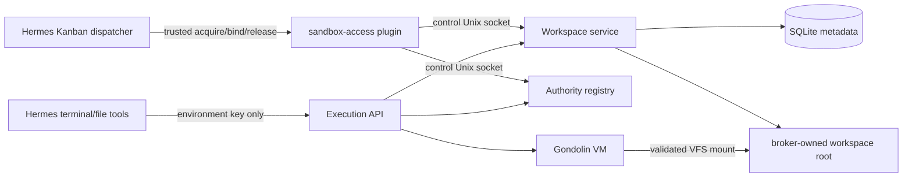
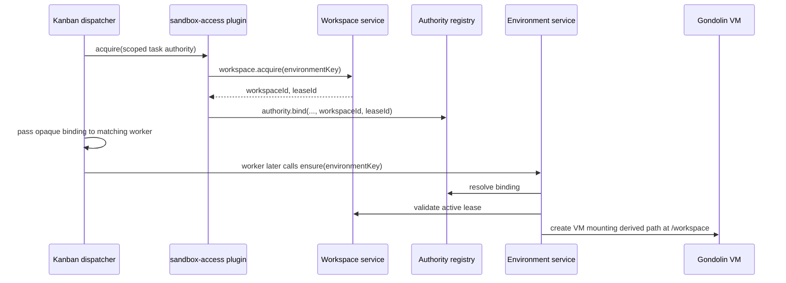
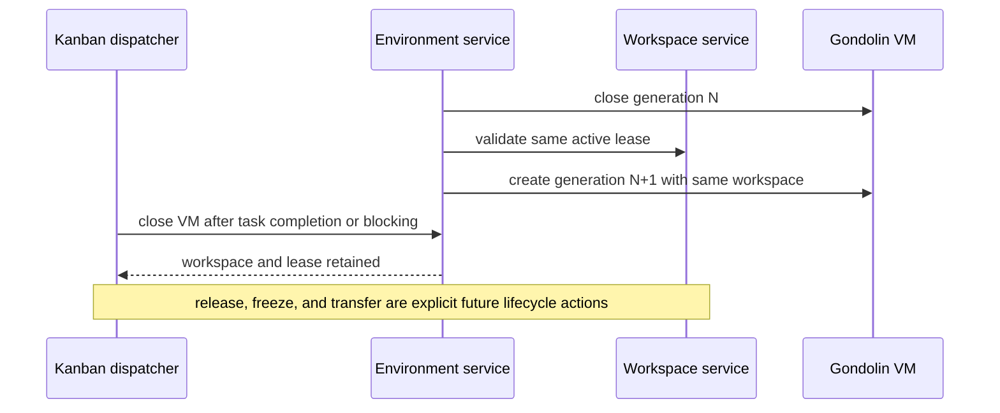

## Context

The Effect broker currently hashes `environmentKey`, creates that directory under `workspaceRoot`, stores the raw path in `environments.workspace_path`, and mounts it into every recreated VM. There is no independent workspace identity, lease, listing, retention, or deletion contract. Hermes Kanban separately persists a gateway host `workspace_path` and injects it as worker cwd, which cannot be the Gondolin guest `/workspace`.

No existing QA workspace data needs retention. The change therefore makes a clean schema and filesystem cutover rather than carrying compatibility logic.

## Goals / Non-Goals

**Goals:**

- Give private sandbox work a stable opaque identity independent of VM generation.
- Persist one writable lease per workspace and fence conflicting writers.
- Remove `environments.workspace_path`; callers never provide host paths.
- Make environment creation resolve a validated broker-owned workspace lease.
- Let trusted Kanban lifecycle code persist/reuse the workspace ID while model-facing schemas expose neither host paths nor workspace selection.
- Cleanly delete the current anonymous QA workspace directories during migration.

**Non-Goals:**

- Project sources, Git operations, COW optimization, publication, credentials, read-only composite inputs, shared writers, household identity, or production deployment.
- Preserving existing anonymous QA environments or their files.
- Turning Kanban into the workspace record of truth.

## Decisions

### Two workspace tables and direct environment references

SQLite adds `workspaces` and `workspace_leases`. The `environments` table is rebuilt without `workspace_path` and contains `workspace_id` and `workspace_lease_id`. No separate binding table is needed: the authority binding identifies who may act, the active lease identifies writable ownership, and the environment record captures the mount used by that VM generation.

`workspaces` stores only identity/lifecycle metadata: ID, owning environment authority key, kind (`private` initially), state, optional retention deadline, and timestamps. `workspace_leases` stores lease ID, workspace ID, environment key, mode, state, monotonically increasing fencing token, and acquisition/release timestamps. A partial unique index permits one active writable lease for a workspace and one active workspace lease for an environment.

Alternative: add a third `environment_workspace_bindings` table. Rejected because the active lease already is the binding and a second mutable pointer creates disagreement and cleanup obligations.

Alternative: keep `workspace_path` nullable for old rows. Rejected because no data is needed and dual behavior would permanently complicate every environment lookup.

### Clean migration

Schema initialization runs under `BEGIN IMMEDIATE`. Detection of `environments.workspace_path` triggers a QA-only clean cutover:

1. record only legacy paths that resolve beneath configured `workspaceRoot`;
2. drop `authority_bindings` and `environments`;
3. create the two workspace tables, indexes, new authority schema, and new environment schema;
4. remove legacy child directories after containment validation;
5. recreate an empty workspace root if needed.

Authorization request/grant tables remain structurally unchanged. Existing grants cannot authorize a new workspace by themselves; normal policy-digest and environment authority checks still apply. Migration failure aborts broker startup rather than mixing schemas.

Alternative: import each old path as a workspace. Rejected by operator decision and because old directories lack lifecycle/ownership evidence.

### Broker-owned IDs and paths

Workspace and lease IDs are random UUIDs. The host path is derived internally as `<workspaceRoot>/data/<workspaceId>` after strict ID validation. Neither execution nor control callers may submit a host path. Directory creation uses mode 0700 and deletion resolves/validates containment before recursive removal.

### Idempotent acquisition

`workspace.acquire(environmentKey, workspaceId?)` is a control-plane operation. With no workspace ID, an existing active lease for the environment is returned; otherwise a new private workspace and lease are created transactionally. With an ID, ownership must match and no conflicting active lease may exist. The first implementation supports only the owning environment key; transfer and cross-task review are deferred.

The execution `ensure` path may create the profile's default private workspace only when automatic default authority binding is permitted. A pre-bound Kanban environment must already have the exact workspace lease registered by trusted lifecycle code. Conflicts fail with stable workspace reason codes.

### Lease and VM lifecycle are separate

Closing, reaping, crashing, or recreating a VM does not release its workspace lease. Task completion and blocking close the live VM but retain the task-private lease and files so a retry can recreate the VM without rebinding broker authority. `workspace.release` is an explicit operator or future handoff transition; it ends the writer lease while retaining files. `workspace.close` marks a released workspace closed. `workspace.delete` requires no active lease, removes the contained directory, and tombstones the row.

Environment reuse requires the same workspace ID and lease ID in addition to authority/policy/asset decisions. A changed lease closes the old VM and creates a new generation. Cross-task transfer is deferred because it requires an explicit revision and handoff authority model rather than mutable authority rebinding.

### Kanban integration stays narrow

The repository-owned `workspace-service` plugin derives a scoped broker authority from trusted Kanban task identity. The dispatcher acquires the task workspace before spawn and passes only `HERMES_WORKSPACE_ID`, `HERMES_WORKSPACE_LEASE_ID`, and `HERMES_WORKSPACE_GUEST_PATH=/workspace`. In broker mode the shared worker launcher removes `HERMES_KANBAN_WORKSPACE`, does not set the gateway scratch directory as `TERMINAL_CWD`, and starts the worker without that directory as process cwd. The task row may still display upstream scratch-workspace bookkeeping, but that path is not the Gondolin workspace or a worker environment input.

Retries derive the same broker authority and reuse the task workspace. Concurrent child tasks derive distinct authorities and workspace IDs. This increment does not import parent files, publish child outputs, or promise useful cross-task project contents.

## Component Diagram

## Sequence Diagrams

### First Kanban claim

### VM recreation and completion

## Risks / Trade-offs

- **Kanban workspace initially contains only private scratch.** This proves lifecycle composition but does not yet make homelab project work useful. Project-provider import is the next change.
- **One environment key owns a workspace.** Sequential cross-task review needs an explicit transfer model later; silently sharing IDs is forbidden.
- **Destructive QA migration.** Existing anonymous files are deleted. This is intentional and accepted because no current work needs retention; containment checks and fail-closed startup prevent deleting outside `workspaceRoot`.
- **SQLite metadata and filesystem creation cannot be one transaction.** Creation uses a provisional row/directory sequence with compensating deletion; startup reconciliation marks incomplete records failed/deleted. Tests inject failures around both boundaries.
- **Rollback is not data-compatible.** The old binary cannot use new workspace records. QA rollback recreates ephemeral state; production is unaffected.
- **Plugin patch size grows.** Keep broker calls in the repository-owned `workspace-service` plugin and add only generic lifecycle hooks plus opaque ID plumbing to Kanban. Do not add provider, revision, publication, or project logic to Hermes.

## QA Acceptance Evidence (2026-07-23)

Operator testing on `hvn-hyp1` established:

- ordinary QA Hermes terminal and file operations use `/workspace`;
- repeated turns retain identical bytes;
- restarting `hermes-qa-broker.service` replaces QEMU processes and VM generation while retaining `/workspace`;
- `/tmp` is ephemeral across recreation;
- a fresh Hermes session receives a different private workspace;
- stopping the broker fails closed with no local, Docker, or Podman fallback;
- Kanban task `t_c2ba7bdd` assigned to `default` completed terminal work in `/workspace`.

The broker-outage result exposed a preflight defect: the plugin returned a process-local cached binding without revalidating broker availability, so the eventual tool backend returned raw `ConnectError: [Errno 2]` rather than the pre-tool hook blocking with a structured workspace-unavailable reason. The security invariant held because no fallback ran. The repository now revalidates cached bindings through idempotent broker acquisition before each workspace-backed tool call; QA redeployment and outage retest remain required.

The Kanban task display retained an upstream `scratch @ /home/hermes/...` record. Broker-mode worker preparation removes that host path from the worker environment and process cwd, so this is redundant orchestration bookkeeping rather than the Gondolin filesystem binding. Raw worker stdout was not retained; the Kanban summary is model-attested evidence. Cross-task filesystem cooperation was not tested and is not supplied by this change.

The current proposal intentionally gives each task a distinct private workspace. A follow-on `add-task-workspace-handoff` change must define immutable parent/child revisions and explicit output publication before isolated tasks can cooperate on filesystem data.