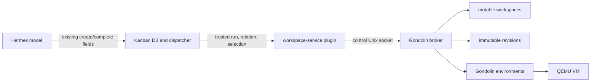

## Context

`add-sandbox-workspace-service` gives each QA Hermes conversation or Kanban task one broker-owned mutable workspace, one fenced writer lease, and a Gondolin VM mounted at `/workspace`. The Kanban dispatcher automatically acquires the task workspace and removes the upstream host scratch path from the worker environment. Completion currently records prose and closes the VM, but no immutable filesystem output is created and no other task can consume the bytes.

The security boundary spans two SQLite databases and three processes: Kanban owns task graph and attempt state; the broker owns workspace, lease, environment, and filesystem state; the Hermes workspace-service plugin bridges trusted lifecycle hooks. There is no atomic transaction across Kanban and broker databases. Guest output is untrusted, may contain hostile paths or files, and must not become a host path capability. Existing model-facing Kanban tools may express task relationships and selected output paths, but storage identifiers remain non-authoritative.

## Goals / Non-Goals

**Goals:**

- Complete one useful vertical slice: publish one task revision and privately fork it into one directly linked consumer.
- Fence the producing run before reading bytes, and make completion truthful and recoverable across the Kanban and broker databases.
- Keep task/run identity, host paths, storage IDs, manifest validation, and import inside trusted dispatcher/broker code.
- Extend existing Kanban operations; add no model-facing workspace-management tool.
- Exercise the slice only on `hvn-hyp1` QA.

**Non-Goals for this increment:**

- Multiple inputs, labels, merges, destination remapping, reviewer mode, shared mutable workspaces, or multi-writer leases.
- Revision grants, revocation, retention/deletion APIs, deduplication, or durable project storage.
- New cancellation semantics or broad Kanban lifecycle redesign beyond completion finalization.
- Repository credentials, VCS operations, project promotion, cross-board/tenant handoff, or production activation.

## Component Model



The model may name relative output paths and may ask a newly created child to inherit the current parent task's output. It cannot name another source task and never invokes broker publication/import operations or supplies a workspace, lease, revision, or host path. The gateway/plugin/backend and protected Unix sockets are trusted; compromise of that account remains outside this increment.

## Decisions

### 1. Ship one end-to-end handoff before generalizing

A producer completion may carry `workspace_outputs`, a non-empty list of relative paths; exact `.` means the whole workspace. One successful completion creates one revision containing those paths at their original workspace-relative locations.

A parent worker's task-creation request may carry `inherit_parent_workspace_output: true`. Kanban records the caller's trusted current task as the sole workspace source and requires the new child to link that parent. The model cannot choose a different source task. After the parent is `done` with one ready revision, trusted dispatch creates one new private writable child workspace containing the entire revision at the same relative paths. The child gets an independent lease. Parent and child never share mutable bytes.

This deliberately defers dependency/sibling imports, labels, multiple sources, path remapping, read-only review, and merging. Those features can be added from observed usage without changing the immutable revision boundary.

Alternative: share the parent workspace. Rejected because concurrent writes destroy completion stability and attribution. Alternative: split publication and consumption into separate changes. Rejected because neither half proves the collaboration path; this one-source slice is the smallest end-to-end result.

### 2. Use small broker records, not a general artifact service

Add broker records conceptually equivalent to:

- `workspace_attempts`: task, Kanban run, workspace, lease, policy digest, monotonic epoch, and state (`active`, `consumed`, `revoked`).
- `workspace_revisions`: opaque revision ID, source task/run/workspace/lease, state (`staging`, `ready`, `quarantined`, `failed`), canonicalization version/digest, counts, finalization ID, and timestamps.
- `workspace_revision_entries`: revision ID, normalized relative path, kind, normalized mode, byte length, and content digest.
- `workspace_revision_operations`: idempotent publication or import ID, request digest, state, result identity, and failure detail.
- `workspace_revision_imports`: source revision, destination task/run/workspace/lease, trusted relation/policy facts, and preparation ID.

There is no grant, retention, deletion, label, or deduplication model in this increment. Revisions are disposable QA data retained until an explicit QA reset.

The workspace, environment registry, and existing access-grant services previously opened the same SQLite path through separate connections. One scoped `BrokerDatabase` Effect service now owns the built-in `node:sqlite` connection and transaction helper, so workspace lease, attempt, environment, revision, and operation mutations can share real transactions. Repository transaction callbacks are deliberately synchronous: nested callbacks join the outer transaction, and no Effect suspension or asynchronous work may occur inside them. `@effect/sql` core is present transitively, but no SQLite driver is installed; adopting it is deferred until a driver or remote-database migration removes more code than it adds. Independent connections or independently started nested transactions are not atomic and must not be treated as such.

### 3. Fence by trusted run activation, not another bearer secret

Before worker spawn, trusted dispatch registers the task's Kanban run against its workspace, active lease, policy digest, and a greater attempt epoch. The terminal backend attaches task/run identity from trusted process state to every broker ensure, execution, and file request; model-facing schemas cannot set or override it. The broker requires the exact active binding. Stable task identity and a retained lease are insufficient.

Completion transactionally consumes the attempt and marks its environment generation closing. Further requests from that run fail immediately. Publication waits for QEMU exit and VFS callback drain. A trusted retry registers a newer run/epoch over the retained workspace; requests carrying the old run remain stale.

A separate random credential on every broker request is deferred. It would not improve the stated boundary because the gateway account and backend are already trusted and can access both protected sockets. If the trust boundary later moves inside the gateway process, capability credentials can be added then.

### 4. Make completion a recoverable saga

Kanban and broker use different SQLite databases, so completion cannot be one transaction:

1. Kanban validates the claimed run and output selection, writes an immutable finalization ID and selection, and moves `running -> finalizing`.
2. A required completion-finalizer invokes the repository-owned workspace-service plugin. Unlike current best-effort observers, its error propagates.
3. The broker binds the finalization ID to source authority and request digest, consumes the attempt, closes the VM, publishes and verifies the revision, then returns its opaque ID and digest.
4. Kanban records broker provenance and moves `finalizing -> done`.
5. Dispatcher recovery claims stale finalizations and repeats the same ID. An identical request returns the same revision; changed source or selection conflicts.

If publication fails, the task remains visibly `finalizing` with failure detail. A trusted operator/retry transition may return it to runnable state with a new run/epoch; model summary prose cannot make it `done` or substitute files.

```mermaid
sequenceDiagram
  participant W as Worker
  participant K as Kanban
  participant P as workspace-service
  participant B as Broker
  participant V as QEMU
  W->>K: complete + workspace_outputs
  K->>K: running -> finalizing
  K->>P: required finalizer
  P->>B: publish(finalization, trusted run, paths)
  B->>B: consume run; mark VM closing
  B->>V: close and drain VFS
  B->>B: copy, fsync, verify, ready
  B-->>K: revision provenance
  K->>K: finalizing -> done
```

### 5. Keep filesystem publication conservative

The manifest contains directories and regular files only. Selected roots are relative POSIX paths; exact `.` is the only whole-workspace selector and is not a manifest entry. Names must be strict UTF-8 and NFC. Paths reject empty segments, `.`, `..`, absolute paths, NUL, normalization collisions, and configured length/depth excess. Regular files with multiple links, symlinks, sockets, FIFOs, devices, unsupported sparse files, and mount crossings are rejected. Logical bytes, staging bytes, entries, and individual file size are bounded incrementally.

Modes normalize to `0755` for directories and executable regular files, `0644` otherwise. Owner, group, timestamps, ACLs, xattrs, and other mode bits are excluded. Entries sort by UTF-8 bytes. The SHA-256 digest uses a documented versioned, domain-separated, length-delimited encoding with fixed-width integers and byte-vector fixtures. Revision IDs remain random and publication-specific.

After attempt consumption, VM exit, and VFS drain, the broker enumerates byte names, uses `lstat`, no-follow final opens, bounded streaming, and before/after identity, link-count, device, size, and mode checks. It fails if exclusive ownership or stability is not established. Content is copied to a broker-derived staging directory, fsynced with parent metadata, atomically renamed on one filesystem, made read-only as defense in depth, and reopened and rehashed before ready state and before import. This does not claim unavailable Node `openat` traversal guarantees.

### 6. Make consumer preparation idempotent

Kanban persists a preparation ID before calling the broker. It verifies the destination was created by the source worker with `inherit_parent_workspace_output`, retains that direct parent link on the same board/tenant, and the source is `done` with a ready revision. The broker control route receives those trusted source/destination authority and policy facts, binds them to the preparation ID and request digest, re-verifies the revision, stages a new private child workspace, records the import, and issues its independent lease.

Kanban records the broker result before spawn. If either process crashes, dispatcher recovery repeats the same preparation ID and receives the same workspace/lease. Reusing the ID with a different source, destination, revision, or policy fails. Revision IDs never enter model requests or ordinary prompt context and are not accepted on the execution listener.

### 7. Keep ownership and rollout narrow

`pkgs/by-name/gondolin-broker-effect` owns attempt/revision/import data, filesystem validation, control routes, and recovery. `pkgs/by-name/hermes-agent-patched` owns generic Kanban fields/finalization plus the repository workspace-service bridge. `modules/den/aspects/workloads/hermes/secure-terminal/default.nix` owns QA roots, limits, policy actions, and service hardening. Only the `hvn-hyp1` QA Gondolin profile enables the feature.

## Risks / Trade-offs

- **Two databases.** Completion and preparation can fail between commits. Mitigation: durable Kanban intent, broker idempotency IDs/request digests, and dispatcher replay.
- **Old workers.** Stable task identity could recreate a closed VM. Mitigation: broker-active task/run/epoch binding on every operation, consumed before publication.
- **Hostile trees.** Paths and resource amplification attack the broker. Mitigation: close and drain all writers first, allowlist node kinds, bound streaming, copy rather than link, and verify after copy.
- **Trusted gateway boundary.** Run identity is not a bearer secret from the gateway. This is intentional: the gateway account already controls both sockets and Hermes credentials. Moving that boundary requires a later capability design, not hidden complexity in this slice.
- **Storage growth.** There is no retention API. Mitigation: QA-only limits and explicit disposable reset; production is blocked until retention is designed from measured usage.
- **Single source only.** Some workflows need aggregation or review. Mitigation: prove the immutable parent/child seam first; add labels/multi-input/reviewer modes as separate changes without weakening revision immutability.
- **Model overclaiming.** Completion prose may name unpublished files. Mitigation: only broker-recorded revision facts satisfy downstream input.
