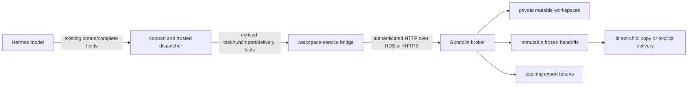

## Context

`add-sandbox-workspace-service` gives each QA Hermes conversation or Kanban task a broker-owned mutable workspace, one writer lease, and a Gondolin VM mounted at `/workspace`. This slice makes only `/workspace/output` durable for cross-task transfer. Everything outside that subtree remains scratch and is never captured.

The boundary crosses Kanban, the Hermes workspace-service bridge, and the broker. Kanban owns the task graph, direct-child relation, board and tenant, source task state, completion metadata, and ordinary attempt lifecycle. The broker owns workspace leases, task-run activations, the handoff operation journal, frozen trees, private destination workspaces, and export tokens. Hermes owns required-finalizer invocation and recipient/channel delivery retry. No cross-database transaction is assumed.

Guest output is untrusted. Names, links, special files, unreadable entries, and resource excess must not become host capabilities. The broker copies bytes into broker-owned storage after fencing and validates structure; it performs no content scanning and does not compare canonical content to establish authority.

## Goals and Non-goals

**Goals:**

- Capture exactly `/workspace/output` automatically on successful broker-backed completion, including a valid empty tree.
- Validate completion metadata before the broker call, then have one broker capture call preflight the live tree, fence the run, close/drain the VM, and publish one immutable handoff.
- Make response loss and post-fence failure recoverable without redispatching producer work or reopening an old activation.
- Give an authorized direct child a private writable copy of its creating parent's frozen output.
- Keep direct-child and task-state validation in Kanban and mutable workspace/handoff authority in the broker.
- Deliver explicit relative files through broker-owned expiring export tokens, with Hermes owning recipient retry.
- Use the same authenticated HTTP contract over local UDS and remote HTTPS, and run only on `hvn-hyp1` QA.

**Non-goals:**

- Capturing the whole workspace, selecting another output root, dependency/sibling inputs, multiple sources, labels, remapping, merging, shared mutable workspaces, or multi-writer leases.
- Content scanning, semantic analysis, deduplication, content-derived authority, retention, deletion, grants, or long-term project storage.
- New model-facing workspace, handoff, import, export, republication, or cancel tools.
- A Kanban lifecycle redesign, production activation, repository credentials, VCS operations, or project promotion.

## Component Model

The model may create a directly linked child and explicitly name human-delivery files through existing `artifacts`, but each model-facing artifact is a relative regular-file path under the trusted task workspace; broker-backed selections additionally lie below `output/`. It cannot name a source task, workspace, lease, handoff, export token, or host path. The dispatcher derives the creating task and current direct-parent facts. Summary/result prose or fields cannot discover or add paths, and a subscription supplies recipients and channels only.

## Decisions

### 1. Fixed output source and one capture call

Every successful broker-backed completion invokes one required finalizer. Before the capture call, Kanban validates the claimed run and selected artifacts using syntax only: each is a normalized relative path under the trusted task workspace and, for broker-backed work, below `output/`; absolute, traversal, URI/drive/host, empty-segment, and symlink-escape syntax fails while Kanban remains `running`. This pre-capture check does not inspect contents or filesystem nodes; `exports/prepare` checks each frozen path is a regular file. Native scratch/dir/worktree flows instead copy each selected relative file into native attachment storage before `done`. Summary/result prose or fields never discover paths.

The finalizer sends one authenticated `POST /v1/control/workspace-handoffs/capture` request containing exactly `finalizationId`, trusted `environmentKey`, `taskId`, and `runId`; schemas reject extras. The broker authorizes the operation and resolves the active activation. It preflights `/workspace/output` while that activation and writer lease are still active. A preflight error leaves the activation, lease, VM, and Kanban `running` state available for correction.

After preflight succeeds, one broker transaction consumes the exact activation and stages the finalization. The broker then revokes the writer lease, marks the VM generation closing, waits for VM exit and VFS callback drain, copies only `/workspace/output` to broker-owned destination-temporary storage, validates the detached tree, fsyncs it, and atomically renames it into finalized handoff storage. An empty output directory follows the same sequence. Before Kanban marks the task `done`, the finalizer calls `exports/prepare` for every selected artifact against the ready frozen handoff; a prepare failure is a completion-operation failure and keeps the task non-done. Later read or platform-delivery failures remain retryable after `done`. Kanban does not enter a new `finalizing` or `publication_failed` task state.

`staging`, `ready`, `publication_failed`, `quarantined`, and `failed` are broker handoff-operation states. If an integration surface uses `finalizing` or `publication_failed` labels, they describe the workspace operation and recovery record, never a newly dispatched Kanban task status. A post-fence failure therefore leaves the task not done under existing lifecycle/retry handling and retains journaled broker recovery state.

### 2. Replay after fencing and fresh-run separation

The broker persists the finalization operation before filesystem mutation and binds the finalization ID to the source activation, task, run, environment, policy decision, and fixed output source. An identical request with the same immutable facts is idempotent.

Replay first resolves the journal. If the operation already consumed the activation, resumed replay follows the recorded operation and returns the existing ready handoff or resumes its staged/post-fence work without validating the active source again. This is required because a consumed activation is intentionally no longer active. A changed task, run, environment, policy, source, or finalization binding is a conflict.

A response lost before the broker has staged or consumed the activation is retried with the same finalization ID; the still-active run can be preflighted again. A response lost after staging, fencing, or publication is retried with that same finalization ID and operation journal. A transient post-fence error is retried through the journal and never redispatches the producer body. If trusted lifecycle deliberately starts a fresh producer attempt, it first activates a fresh globally unique run ID and allocates a fresh finalization ID; the old activation and operation remain fenced and are not reused.

### 3. Activation fencing covers completion, block, and reclaim

Before worker spawn, trusted dispatch activates a globally unique Kanban run against the task, workspace, active lease, and policy digest. The backend attaches task/run identity to every ensure, execution, and file request. Stable task identity and lease knowledge alone cannot create a VM or access files.

Successful capture consumes the activation before reading output bytes. A block, timeout, or operator reclaim also consumes or supersedes the active activation before asking the environment to close. The close operation is ordered after that state transition. Thus a late request from the old run cannot recreate a VM generation or mutate retained output, and every later retry obtains a fresh run activation. Reclaim does not capture, import, export, or deliver data.

### 4. Handoff records and journal, not a path service

The broker uses records conceptually equivalent to:

- `task_run_activations`: random activation ID, Kanban task/run, environment, workspace, lease, policy digest, and `active`/`consumed`/`superseded` state.
- `workspace_handoffs`: random opaque handoff ID, finalization ID, source activation/task/run/workspace/lease provenance, policy digests, `staging`/`ready`/failure state, structural counts, and failure detail.
- `workspace_handoff_imports`: preparation ID, ready source handoff, derived destination task/run/environment, policy provenance, private workspace/lease, and import state.
- `workspace_handoff_exports`: delivery ID, handoff ID, normalized relative file, opaque expiring export token, size, expiry, and `active`/`released`/`expired` state.
- An operation journal that records preflight, fencing, copy, detached validation, fsync/rename, import, and export outcomes before filesystem mutation where applicable.

The final tree is broker-owned and immutable. IDs are never paths and never accepted as model authority. Failed temporary or quarantine state remains accounted for through the journal; no entry is silently removed to make publication succeed.

### 5. Validate structure with only wired limits

The source and detached destination are checked in two phases. Preflight uses trusted `lstat`/no-follow operations on the fixed output root and rejects absolute or host paths, empty or traversal segments, NUL, invalid UTF-8, normalization collisions, symlinks, disallowed hardlinks, sockets, devices, FIFOs, unreadable entries, and excess of these four policy limits only:

- `maxLogicalBytes` (sparse files count by logical size),
- `maxEntries`,
- `maxFileBytes`, and
- `maxPathBytes`.

Post-fence copying follows no links, crosses no source filesystem boundary, preserves no hardlinks, and carries no host ownership/ACL/xattr authority. Detached validation checks node kind, independent destination identity, readability, normalized modes, and the same four limits before fsync and atomic rename. Copying bytes is storage, not content inspection.
After Kanban validation, trusted dispatch passes exactly `preparationId`, `sourceHandoffId`, `sourceTaskId`, `destinationTaskId`, `destinationRunId`, and `destinationEnvironmentKey` to `POST /v1/control/workspace-handoffs/import`; schemas reject extras and no source-run, board, tenant, parent/link, source-state, policy, workspace, lease, or host-path assertion is accepted. The broker derives source provenance from the immutable handoff record (producing task/run/environment and ready frozen storage), rejects a source-task mismatch, derives destination provenance from trusted destination task/run/environment records, binds the derived IDs to one preparation ID, verifies the ready handoff, copies only the frozen tree into a destination temporary, atomically installs one private writable workspace, and issues an independent lease.
A preflight failure leaves the source untouched and recoverable. A fenced copy or detached-validation failure records `publication_failed`, `quarantined`, or `failed` operation state with the temporary/failure detail. No partial tree is exposed and no offending entry is silently deleted or skipped.

### 6. Kanban owns every import proof

A child may inherit output only through the current Kanban operation. On every import attempt, including recovery after a preparation response loss, Kanban revalidates:

1. the destination was created by the recorded source task as a direct child;
2. the direct-parent link still exists;
3. source and destination are on the same board and tenant;
4. the source task is `done` under existing Kanban semantics and has exactly one ready handoff;
5. source and destination assignee policies permit the copy; and
6. the source handoff still belongs to that source task and policy.

If the link, board, tenant, source state, handoff, or policy changes before import, Kanban rejects before calling the broker and leaves the destination blocked/non-runnable. The broker never receives a model-selected proof. After Kanban validation, trusted dispatch passes exactly `preparationId`, `sourceHandoffId`, `sourceTaskId`, `destinationTaskId`, `destinationRunId`, and `destinationEnvironmentKey` to `POST /v1/control/workspace-handoffs/import`; schemas reject extras. The broker derives source provenance from the immutable handoff record, rejects a source-task mismatch, derives destination provenance from trusted destination task/run/environment records, binds the IDs to one preparation ID, verifies the ready handoff, copies only the frozen tree into a destination temporary, atomically installs one private writable workspace, and issues an independent lease.

An identical preparation replay returns the same destination workspace and lease. A changed source, destination, relation-derived fact, handoff, or policy conflicts. A blocked/rejected reviewer or child receives no empty substitute and no live-parent read; it cannot promote, complete, capture, or deliver a parent draft. Child changes remain private and are captured automatically on child completion.

### 7. Export-token protocol and ownership

Human delivery is explicit and separate from capture. Hermes stores recipients/channels and explicit relative artifact selections, owns retry scheduling, and does not infer files from subscriptions or summary prose. Before `done`, the required finalizer prepares every selected path against the ready frozen handoff. For each selected file it uses:

1. `POST /v1/control/workspace-handoffs/exports/prepare` with exactly `deliveryId`, opaque `handoffId`, and normalized `relativePath`; schemas reject extras, and the broker verifies that the path is one regular file in frozen storage, returning an expiring opaque `exportToken`, basename, size, and expiry.
2. `POST /v1/control/workspace-handoffs/exports/read` with only `exportToken`; the broker reauthorizes the handoff and streams that one frozen file with no shared spool.
3. `POST /v1/control/workspace-handoffs/exports/release` with only `exportToken`; Hermes calls this after successful, failed, or interrupted delivery. Expiry or release makes subsequent reads fail; an interrupted stream cannot make the token permanent.

The active prepare idempotency tuple is `(deliveryId, handoffId, relativePath)`: an identical retry after response loss returns the same active token/name/size/expiry, a changed tuple conflicts, an expired or released delivery ID fails, and a fresh delivery uses a new delivery ID. The same HTTP request/response and streaming contract runs over the local broker UDS client and over remote HTTPS. Remote HTTPS requires a principal's mandatory bearer credential from a trusted deployer secret, standard CA and hostname verification, and disabled redirects; TLS terminates at the remote service. The current QA UDS mode configures no remote HTTPS or bearer credential. Transport selection does not alter route names, schemas, authorization, or token ownership. Recipient outages are Hermes delivery failures, not broker handoff failures; the handoff and Kanban `done` result remain valid while Hermes retries later read/platform delivery.

### 8. Listener, gate, and rollout boundaries

Capture, import, and the three export routes exist only on the authenticated control listener. They are absent when `workspaceHandoffEnabled` is false; disabled startup also creates no handoff schema/root or migration behavior. The execution listener has no handoff-management route and receives no handoff IDs, export tokens, broker roots, or content paths.

Ordinary/non-Gondolin workers retain existing per-session CWD and workspace behavior. A broker-backed Kanban worker receives only guest `/workspace`; host scratch and host process CWD are not authority. A broker outage fails workspace-backed work closed or leaves it retryable without local, Docker, Podman, host-path, or empty-handoff fallback, and recovery happens in process.

Only `hvn-hyp1` enables the feature. Rollback disables the QA gate and restarts only QA services. A destructive QA reset stops QA gateway/sockets/service, verifies and quarantines the whole canonical `/var/lib/hermes-qa-sandbox` state directory (never production or Podman), recreates it with mode `0700`, and verifies fresh capture, import, and export prepare/read/release before quarantine deletion. Acceptance records disabled routes, reset, rollback, and unchanged production/Podman state.

## Risks and Trade-offs

- **Two databases:** durable Kanban intent and broker-bound IDs make completion/import replayable without pretending the databases share a transaction.
- **Hostile trees:** no-follow preflight, fencing before copy, four explicit limits, detached validation, atomic rename, and quarantine prevent capability leakage.
- **Response loss:** journal-first operation identity separates same-operation replay from a deliberate fresh run.
- **Storage lifecycle:** no retention or deletion API is exposed; QA reset is the explicit operator lifecycle for this disposable slice.
- **Single source:** direct-child proof is deliberately narrow; aggregation, reviewer modes, and multiple sources remain separate changes.
- **Trusted gateway:** local UDS and authenticated remote HTTPS protect transport, but the trusted dispatcher remains the source of task/run identity; gateway-account compromise is outside this slice.
- **External Codex:** registered external Codex lanes retain their existing host-visible worktrees and are not claimed as Gondolin-isolated.
